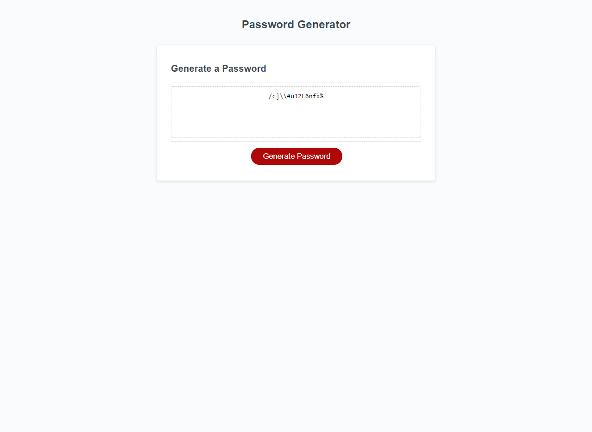

# Password Generator

## General 📖
---
- ***Date***:           12/24/2020
- ***Author***:         Brandon Haley
- ***Email***:          Kyle7286@gmail.com
- ***Github***:         https://github.com/Kyle7286/password-generator
- ***Website***:        https://kyle7286.github.io/password-generator/

## About/Purpose ❔
---
The purpose of this webpage is to utilize javascript and create a password generator which accepts a specific set of criteria from the user and outputs a random password containing at least one of each type selected.

## Takeaways 🥡
--- 
* Learned the value of psuedo code to plan out the logic
* Gained confidence in use of objects and the efficiency of dot notation
* Learned how to escape special VSCode characters to see them as their actual character instead of a inherit function
* *WAS REALLY HARD* Figured out how to traverse an OBJECT that has an ARRAY of OBJECTS via Object.getOwnPropertyNames()
* Learned the effectiveness of using true and false; which can be added together to sum to a number
* Learned how to refactor my own code by researching other tactics for handling certain situations, then implementing/retrofitting the code accordingly
* Learned that chartypes have a computer ALT code associated with them

## Screenshot 📊
---

## Thank you 👍
---
    Thank you for your time reviewing my project/code!
    I offer you a relaxing scenery; enjoy.

Eastern Fjords of Iceland
